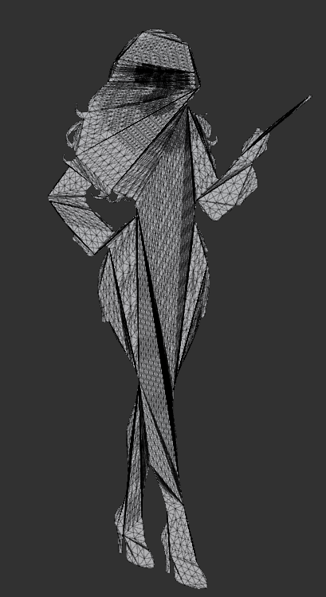
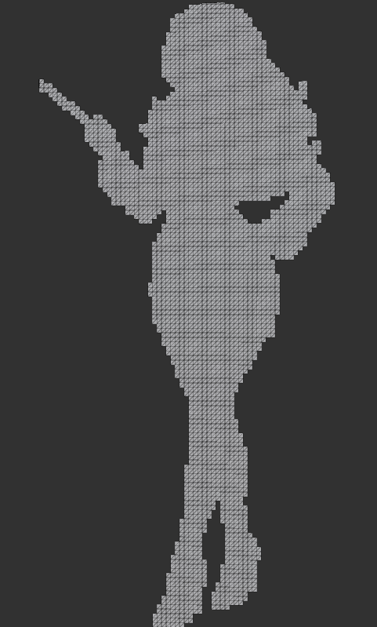
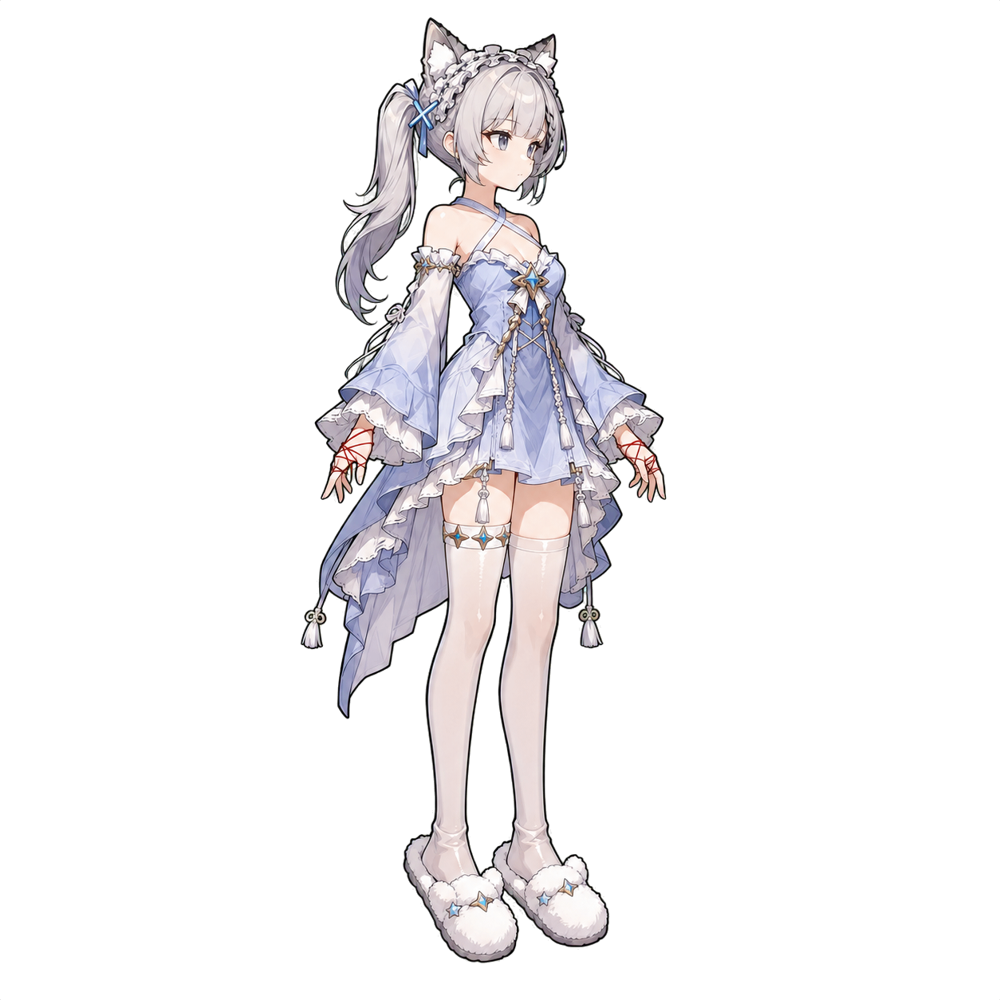

# 概述
在很多低成本游戏中，立绘都是纯静态图，因为制作 Spine 或 Live2D 动画需要较高的时间和金钱成本。即使有了 AI，可以很轻易地生成 AI 视频，但在游戏中播放视频仍然相对麻烦。也可以将视频转成序列帧，但高清立绘生成的流畅序列帧体积很大，一次性加载通常难以接受。
本文提供一种基于 AI 和 Mesh 顶点动画制作类似 Live2D 效果的技术。无论是内存占用、运行时开销还是制作成本，这种方案都比较低，适合不追求高质量立绘动画的项目。下面是仅靠单张立绘（无分层）制作的 Idle 效果：

<div align="center">
<video src="MaoNiang_Final.mp4" controls></video>

<video src="Woman.mp4" controls></video>
</div>

## 准备
初始美术资源只需要一张图片。制作过程中还会用到其他资源，但这些资源都可以基于这张图片生成；如果已经具备这些资源，则可以直接使用。
需要安装 FFmpeg 和 OpenCV，并通过 Python 调用，也可以让 AI Agent 协助安装。
本文使用 Unity 演示，因此最好准备好 Unity 命令行环境及流水线所需的包，也可以让 Agent 协助安装。这一步很重要，因为生成 Unity 资源的过程中需要编写并执行一些 Unity 代码。

## 基本原理
基本原理与 Mesh 变形、Blend Shape 类似，都是通过改变 Mesh 的顶点位置形成动画。至于从图片生成 Mesh，则可以利用 AI 技术，也可以人工制作。完成一系列姿态 Mesh 后，将后一个姿态的顶点位置减去前一个姿态的顶点位置，把得到的差值写入相应的 Mesh 通道，再由顶点 Shader 根据当前动画进度，将这些通道中存储的差值按权重累加到原始顶点位置上。

# 具体制作过程
## 生成 Mesh
生成 Mesh 时，不能只跟 AI Agent 说“帮我把这张图片转成 Mesh”。如果只提供这样的要求，它生成的 Mesh 很可能是这样：

<div align="center">

</div>


这个 Mesh 的问题在于存在很多非常长的三角形边。虽然看上去划分了身体部位，但实际上无法正常使用。这种 Mesh 会导致局部顶点移动时，相距很远的顶点也随之移动，最终使全身动画变得非常奇怪。

我的方法是先定义一个数据结构，让 AI 分析图像中包含哪些身体部位，再记录每个部位的顶点索引。这样也方便后续生成其他姿态的 Mesh 时进行参考。

```
[SerializeField]
private Mesh _mesh;
[SerializeField]
private List<Region> _regionList = new List<Region>();


[Serializable]
public sealed class Region
{
    #region fields
    [SerializeField]
    private string _regionName;
    [SerializeField]
    private int[] _vertexIndices;
    #endregion
    
    #region properties
    public string Name => _regionName;
    public IReadOnlyList<int> VertexIndices => _vertexIndices;
    #endregion
    
    #region methods
    public Region(string name, int[] indices)
    {
        _regionName = name;
        _vertexIndices = indices;
    }
    #endregion
}
```

需要向 Agent 明确说明：顶点应使用规则网格，相邻四点组成一个小矩形，再拆分成两个局部三角形；禁止生成跨网格、跨透明区域或跨身体部位的长三角形边。这样生成的 Mesh 才能符合要求：

<div align="center">

</div>

关于身体部位，如果只看图片，AI 的分析结果不一定适用于目标动画。最好直接提供所需动画的视频或文字描述，这样分析结果会更加准确。

## 生成姿态 Mesh
这一步用于生成具体的姿态 Mesh。我目前使用的方案最多包含 13 个姿态（包括初始姿态）。如果一个动作幅度过大或包含往复运动，直接从初始姿态变换到最终姿态显然无法正确表现动作过程。

### 姿态 Mesh 的硬性约束
所有姿态 Mesh 都必须由同一个初始 Mesh 变形得到，并满足以下约束：

- 顶点数量必须完全一致。
- 顶点索引和排列顺序必须完全一致；每个索引在所有姿态中都必须对应同一个身体位置。
- 三角形拓扑必须完全一致，不能重新布线，也不能增加、删除或合并顶点。
- UV0 的数量、索引关系和纹理对应关系必须保持一致，以保证所有姿态都能正确采样原始贴图。
- 所有姿态必须使用相同的对象坐标空间、原点、朝向和缩放，不能通过改变 Transform 代替顶点变形。
- 当前方案只记录顶点的 XY 位移，因此不要依赖 Z 轴变化表达动画。

需要特别注意，顶点数量相同并不代表 Mesh 一定兼容。如果顶点顺序或拓扑发生变化，相同索引就会指向不同的身体位置，编码后的动画将出现撕裂、跳点或大范围错误变形。当前编码工具只会自动检查顶点数量，其余约束需要在生成姿态 Mesh 时自行保证。

这里使用的动作来自一个由 AI 根据立绘生成的视频（立绘本身也是由 AI 生成的）：

<div align="center">

</div>

<div align="center">
<video src="ActionRefVideo.mp4" controls></video>
</div>


我的工作流是让 AI 参考这张图片和视频，生成各个姿态 Mesh。

具体来说，AI 会使用前面提到的 FFmpeg 和 OpenCV 分析视频，找出视频中真正的循环区间。例如，一个 10 秒的视频可能只是将 2.5 秒的动作重复了 4 次，所以这一步非常重要。如果错误地将完整的 10 秒视频视为一个循环，每个关键帧的位置就会出现偏差。

AI 确定需要采用哪些关键帧后，就可以为每个关键帧生成对应的 Mesh。注意，为了保证循环效果，最后一个关键帧需要能够平滑过渡回初始姿态。

## 计算顶点差值
为了方便动画计算，这里会计算每个姿态相对于前一个姿态的顶点位置差值，并将其保存到最终的 Mesh 通道中。由于处理的是 2D 图片，所以只需要保存 XY 变化。12 个后续姿态对应 12 组差值。当前实现使用 Normal、Tangent、UV0.zw 以及 UV1～UV4 存储这些数据，其中 UV0.xy 必须保留用于采样贴图。

```
float3 keyFrame1 : NORMAL;
float4 keyFrame2And3 : TANGENT;
float4 uv0AndKeyFrame4 : TEXCOORD0;
float4 keyFrame5And6 : TEXCOORD1;
float4 keyFrame7And8 : TEXCOORD2;
float4 keyFrame9And10 : TEXCOORD3;
float4 keyFrame11And12 : TEXCOORD4;
```

## Shader 计算顶点动画
接下来在 Shader 中设置动画进度参数 `_AnimationProgress`，取值范围为 0～1，并使用如下算法变换顶点位置：

```
float animationProgress = saturate(_AnimationProgress) * (_AnimationCount + 1.0);
float keyFrameProgress = min(animationProgress, _AnimationCount);
positionOS.xy += input.keyFrame1.xy * saturate(keyFrameProgress);
positionOS.xy += input.keyFrame2And3.xy * saturate(keyFrameProgress - 1.0);
positionOS.xy += input.keyFrame2And3.zw * saturate(keyFrameProgress - 2.0);
positionOS.xy += input.uv0AndKeyFrame4.zw * saturate(keyFrameProgress - 3.0);
positionOS.xy += input.keyFrame5And6.xy * saturate(keyFrameProgress - 4.0);
positionOS.xy += input.keyFrame5And6.zw * saturate(keyFrameProgress - 5.0);
positionOS.xy += input.keyFrame7And8.xy * saturate(keyFrameProgress - 6.0);
positionOS.xy += input.keyFrame7And8.zw * saturate(keyFrameProgress - 7.0);
positionOS.xy += input.keyFrame9And10.xy * saturate(keyFrameProgress - 8.0);
positionOS.xy += input.keyFrame9And10.zw * saturate(keyFrameProgress - 9.0);
positionOS.xy += input.keyFrame11And12.xy * saturate(keyFrameProgress - 10.0);
positionOS.xy += input.keyFrame11And12.zw * saturate(keyFrameProgress - 11.0);
float returnProgress = saturate(animationProgress - _AnimationCount);
positionOS.xy = lerp(positionOS.xy, input.positionOS.xy, returnProgress);
```

可以看到，从最后一个姿态回到初始姿态的计算与之前稍有不同：需要从最后一个姿态插值到初始姿态，而不是直接把变化量累加到前一个位置上。

# 注意事项
目前演示的内容都是基于单张图片生成，没有进行任何图片分层。做过 Live2D 或 Spine 的同学应该知道，单张图片通常是不够的。例如，当衣服和皮肤相连的部位发生顶点变形时，衣服会带着皮肤一起变形，造成肌肉异常扭曲、局部异常膨胀等问题。对于这些区域，需要明确要求 AI 不要进行大幅变形。

解决思路是对图片进行分层。前面介绍的技术在分层后依然适用，但需要让 AI 在生成 Mesh 时注意各层相对于原点的坐标。

但目前 AI 还无法很好地完成切图分层，等相关能力更加成熟后，我会再补充后续工作流。

即便如此，本文介绍的方案依然具有实际意义。现在仍有大量游戏，尤其是低成本独立游戏，其立绘和部分场景元素仍然使用静态图片。通过这种方式，可以用几乎零成本将这些图片转换成动态图，从而提升画面表现力和制作效率。

以上就是本文的全部内容，欢迎讨论。

# 工具使用说明
本工程提供了一个 Unity 编辑器工具，用于将初始姿态和后续姿态 Mesh 的顶点差值编码到最终 Mesh 中。使用步骤如下：

1. 使用 Unity 打开 `ImageToMeshAnim_Unity` 工程。
2. 在顶部菜单中选择 `Tools > Mesh > Encode Vertex Key Frames`，打开编码工具。
3. 将初始姿态 Mesh 放入 `Start Pose Mesh`，再按照播放顺序将 1～12 个后续姿态 Mesh 放入 `Animation Pose Meshes`。所有 Mesh 都必须满足前文所述的硬性约束。
4. 单击 `Generate Mesh Asset`，选择保存位置并生成包含顶点动画数据的 Mesh 资源。
5. 创建材质并选择 `ImageToMeshAnim/Vertex Delta` Shader，然后设置原始贴图，并将 `_AnimationCount` 设置为后续姿态 Mesh 的实际数量。
6. 将生成的 Mesh 和材质赋给 `MeshFilter`、`MeshRenderer`，再通过 Animation、脚本或其他方式让材质参数 `_AnimationProgress` 从 0 变化到 1，即可循环播放动画。

工程中的 `Assets/ImageToMesh/Sample/GeneratedMeshes/MaoNiang` 提供了完整示例，包括生成后的 Mesh、材质、动画片段、Animator Controller 和 Prefab，可用于对照设置。
